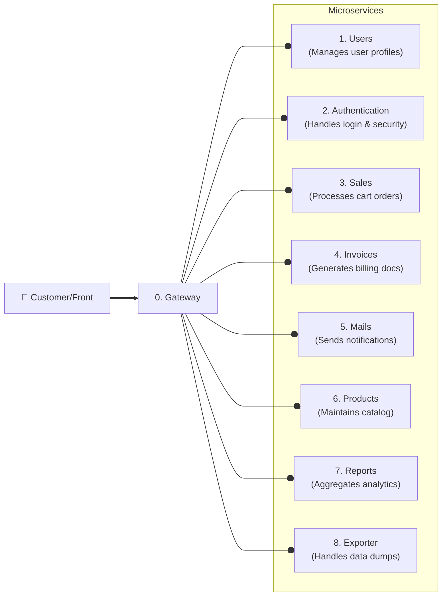

# 🚀 Spring Boot Microservice Layout

## Description

This repository provides a configuration layout for each microservice of the
project. The idea is to apply the provided settings and files into all the
microservices to unify workflows between developers.

## Tech Stack

### Infrastructure:

- [Java 25 LTS](https://docs.oracle.com/en/java/javase/25/): The latest Java
  Long Term Support version.
- [Spring Boot v4.0.6](https://github.com/spring-projects/spring-boot): Latest
  stable version.
- [Docker](https://docs.docker.com/) &
  [Docker Compose](https://docs.docker.com/compose/): For containerization,
  develop environment & deployment.
- [MySQL v8.4 LTS](https://hub.docker.com/_/mysql): Database

### Dependencies:

1. **Lombok:** Reduce boilerplate
2. **Validation:** Jakarta bean validation
3. **Spring Boot DevTools:** Autoreload & quality of life enhancements
4. **Spring Web:** Provides REST capabilities for MVC
5. **SpringDoc:** Provides autogenerated OpenAPI documentation (AKA Swagger)
6. **Spring Data JPA:** ORM
7. **Driver Mysql:** Handles the DB connection
8. **Flyway Migration:** DB migrations
9. [fmt-maven-plugin](https://github.com/spotify/fmt-maven-plugin) and
   [Google Java Formatter](https://github.com/google/google-java-format): Code
   autoformatter for consistent code style.

## Standarization

### Project Metadata

- The microservice name should begin with `Microservice`. For example:
  `MicroserviceFoo`.
- The **group** should begin with `cl.duoc`.
- The **artifact** should be lowercase letters only, avoid spaces and use `-`.

### Naming conventions

#### Tables

- Table names & columns should be in `snake_case`.
- Table names should be in plural

#### Classes/Entities

There's no enforcement on the microservice code names or approaches. Just the
following suggestions:

| Type                   | Recommendation                                                    | Examples                                                            |
| ---------------------- | ----------------------------------------------------------------- | ------------------------------------------------------------------- |
| Entities               | Singular                                                          | User, Payment                                                       |
| Services               | Singular                                                          | UserService, PaymentService                                         |
| Repositories           | Singular                                                          | UserRepository, PaymentRepository                                   |
| Controllers            | Singular                                                          | UserController, PaymentController                                   |
| Collections / Wrappers | Plural only if contain multiple items                             | Payments, UserList                                                  |
| Exceptions             | Singular. Should end with `Exception`                             | InvalidPaymentException, UnauthorizedRequestException               |
| DTOs                   | Singular. Plural only if the DTO itself is a collection container | CreateUserRequest, UserResponse, SaleSummaryResponse, SalesResponse |

### API / Endpoints

The project follows the
[RESTful API standard](https://cloud.google.com/discover/what-is-rest-api).

- Every microservice should prefix endpoints with `/api/v1/` (or the
  corresponding version).
- Use **plural resource names** in paths. For example: `/api/v1/users`,
  `/api/v1/sales`.
- Use **HTTP methods to express actions**; avoid verbs in URLs.

#### Standard patterns

| Action        | Method | Endpoint             |
| ------------- | ------ | -------------------- |
| Get all       | GET    | `/api/v1/users`      |
| Get one       | GET    | `/api/v1/users/{id}` |
| Create        | POST   | `/api/v1/users`      |
| Update (full) | PUT    | `/api/v1/users/{id}` |
| Update (part) | PATCH  | `/api/v1/users/{id}` |
| Delete        | DELETE | `/api/v1/users/{id}` |

- Avoid endpoints like `/get-all`, `/add`, `/delete`.
- Use **nouns for resources**, not actions.
- Keep paths **lowercase and `kebab-case`** if needed (`/order-items`).

---

## Project setup

Copy the following files into the project root directory:

- `.env.example`
- `.gitignore`
- `compose.yml`

And also copy the Spring Boot properties files to the corresponding paths:

- `src/main/resources/application.properties`
- `src/main/resources/application-dev.properties`

## 🛠️ Development environment

### Setup the DB container

1. Create a `.env` file from the provided [.env.example](.env.example) and
   modify the settings values accordly. In particular, check the **database
   name**:

   > ```yaml
   > MYSQL_DATABASE=foo
   > ```

2. Start the db container:

   > ```bash
   > docker compose up -d
   > ```

3. Check the db status through the provided **phpmyadmin** service and put the
   defined credentials:
   - Go to [http://localhost:8088](http://localhost:8088)
   - Use the defined credentials. By default:
     - **User:** `user`
     - **Password:** `password`

### Formatter setup

Add the plugin into the project's `pom.xml` file:

```xml
    <build>
        <plugins>
            <plugin>
                <groupId>com.spotify.fmt</groupId>
                <artifactId>fmt-maven-plugin</artifactId>
                <version>2.29</version>
                <executions>
                    <execution>
                        <goals>
                            <goal>format</goal>
                        </goals>
                    </execution>
                </executions>
                <dependencies>
                    <dependency>
                        <groupId>com.google.googlejavaformat</groupId>
                        <artifactId>google-java-format</artifactId>
                        <version>1.35.0</version>
                    </dependency>
                </dependencies>
            </plugin>
        </plugins>
    </build>
```

With this, on every project build the source files should be formatted by the
plugin.

#### Manual formatting

Run this to format the codebase through the CLI:

```bash
./mvnw fmt:format
```

#### IDE

A
[google-java-format](https://marketplace.visualstudio.com/items?itemName=JoseVSeb.google-java-format-for-vs-code)
plugin/extension is available for VSCode and can be installed to format code on
save.

However, no IDE configuration is required. Formatting is enforced automatically
during the Maven build, ensuring consistent style across all environments.

## 🏗️ Development workflow

The project follows a trunk-based workflow on the `develop` branch. Production
ready code lives in `main`.

### Git commit messages

The project adheres to the
[Conventional Commits](https://www.conventionalcommits.org/en/v1.0.0/)
specification.

- Use the format:

  ```
  <type>(<scope>): <subject>
  ```

  For example:

  ```
  feat(UserService): add non-duplicated username validation check
  ```

- Common types:
  - `feat`: new feature
  - `fix`: bug fix
  - `refactor`: code change without behavior change
  - `docs`: documentation only
  - `chore`: maintenance tasks
  - `test`: adding or updating tests

- Keep the **subject line ≤ 72 characters**
  - Use imperative mood (e.g., “add”, not “added”)
  - Do not end with a period
  - Use `&` instead `and`

Optional body allowed but wrap lines at 72 characters. Explain _what_ and _why_,
not _how_.

---

## Design

The application uses a Microservice architecture. This are the current
microservices with they descriptions.

## Microservices

| Name              | URL Repository                             | Description        |
| ----------------- | ------------------------------------------ | ------------------ |
| MicroserviceSales | [github](https://github.com/polirritmico/) | Handle sales logic |

## Architecture microservice diagram


