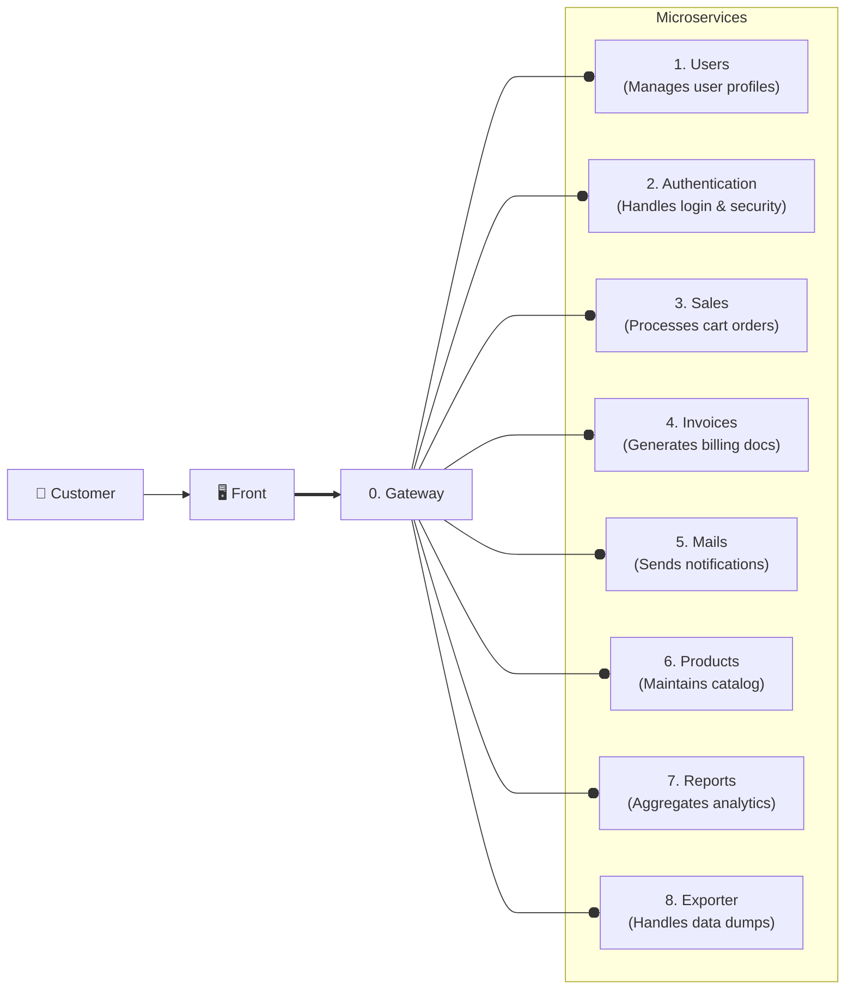

# 🚀 Spring Boot Microservice Layout

## Description

This repository provides a configuration layout for each microservice of the
project. The idea is to apply the provided settings and files into all the
microservices to unify workflows between developers.

## Tech Stack

### Infrastructure:

- [Java 25 LTS](https://docs.oracle.com/en/java/javase/25/): The latest Java
  Long Term Support version.
- [Spring Boot v4.0.6](https://github.com/spring-projects/spring-boot): Latest
  stable version.
- [Docker](https://docs.docker.com/) &
  [Docker Compose](https://docs.docker.com/compose/): For containerization &
  deployment.
- [MySQL v8.4 LTS](https://hub.docker.com/_/mysql): Database

### Dependencies:

1. Lombok: Reduce boilerplate
2. Validation: Jakarta bean validation
3. Spring Boot DevTools: Autoreload & quality of life enhancements
4. Spring Web: Provides REST capabilities for MVC
5. SpringDoc: Provides autogenerated OpenAPI documentation (AKA Swagger)
6. Spring Data JPA: ORM
7. Driver Mysql: Handles the DB connection
8. Flyway Migration: DB migrations
9. [Google Java Formatter](https://github.com/google/google-java-format): Code
   autoformatter for consistent code style.

---

## Project setup

Copy and adapt the following files:

- `.env.example`
- `.gitignore`
- `compose.yml`

## 🛠️ Development environment

### Setup the DB container

1. Adapt the provided [compose.yml](compose.yml). In particular the database
   name:

### Formatter setup

This are the installation instructions from the repository:

For source formatting, add the spring-javaformat-maven-plugin to your build
plugins as follows:

```xml
<build>
	<plugins>
		<plugin>
			<groupId>io.spring.javaformat</groupId>
			<artifactId>spring-javaformat-maven-plugin</artifactId>
			<version>0.0.47</version>
		</plugin>
	</plugins>
</build>
```

And the io.spring.javaformat plugin group in ~/.m2/settings.xml as follows:

```xml
<pluginGroups>
	<pluginGroup>io.spring.javaformat</pluginGroup>
</pluginGroups>
```

You can now run `./mvnw spring-javaformat:apply` to reformat code.

## 🏗️ Development workflow

The project follows a trunk-based workflow on the `develop` branch. Production
ready code lives in `main`.

---

## Design

The application uses a Microservice architecture. This are the current
microservices with they descriptions.

## Components


