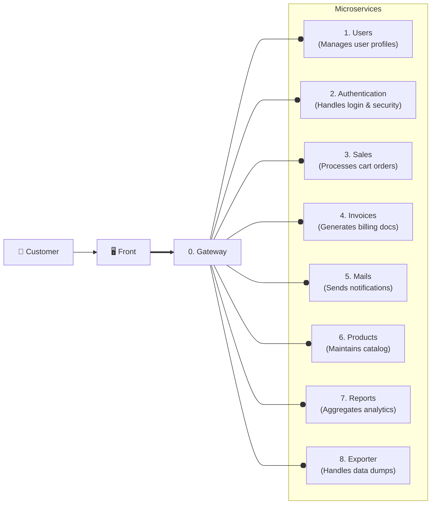

# 🚀 Spring Boot Microservice Layou

## Tech Stack

This repository provides the basic configuration for a proper microservice using
the folloring tech stack:

- [Java 25 LTS](https://docs.oracle.com/en/java/javase/25/): The latest Java
  Long Term Support version.
- [Spring Boot v4.0.5](https://github.com/spring-projects/spring-boot): Latest
  stable version.
- Docker & Docker Compose: For containerization & deployment.
- [MySQL v8.4 LTS](https://hub.docker.com/_/mysql)

## CI

- Formatter:
  [Google Java Formatter](https://github.com/google/google-java-format)
- Migrations: [Flyway](url)
- prettier:

## Design

The application is going to use a Microservice architecture. This are the
current microservices with they descriptions.

## Components



---

## Development environment

1. Clone the repo

```bash
git clone git@github.com:polirritmico/springboot-layout.git
```

2. 🐳 Use Docker Compose:

Simply start the provided services:

```bash
docker compose up -d
```

This would start the DB service and PHPMyAdmin.

### Formatter

The project uses:
[spring-javaformat](https://github.com/spring-io/spring-javaformat).

This are the installation instructions from the repository:

For source formatting, add the spring-javaformat-maven-plugin to your build
plugins as follows:

```xml
<build>
	<plugins>
		<plugin>
			<groupId>io.spring.javaformat</groupId>
			<artifactId>spring-javaformat-maven-plugin</artifactId>
			<version>0.0.47</version>
		</plugin>
	</plugins>
</build>
```

And the io.spring.javaformat plugin group in ~/.m2/settings.xml as follows:

```xml
<pluginGroups>
	<pluginGroup>io.spring.javaformat</pluginGroup>
</pluginGroups>
```

You can now run `./mvnw spring-javaformat:apply` to reformat code.

## 🏗️ Development workflow

The project follows a trunk-based workflow on the `develop` branch. Production
ready code lives in `main`.
